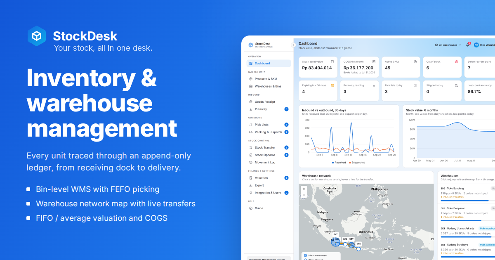

# StockDesk



**Your warehouse and inventory, perfectly in sync.** StockDesk is an inventory
and warehouse management system for retail, distributors, D2C brands and small
fulfillment warehouses. Every unit moves through an append-only ledger, from
the receiving dock to the delivery order, so the stock numbers and their value
always come from what the team actually did.

**Live demo:** [stockdesk.mujahidin.my.id](https://stockdesk.mujahidin.my.id)
(pick a demo account on the login page)

## The problem it solves

In a lot of warehouses, goods receipts are written on paper, only the senior
picker knows where things are, and stock opname lives in a spreadsheet that
never matches the system. The result is stock loss, slow picking, wrong
shipments and nobody knowing what the stock is worth today. StockDesk keeps
receipts, locations, picking, counts and value in one place.

## Features

**Inventory**

- Stock per warehouse, bin and batch, with nested units (Box > Pack > Pcs)
- Products with a variant matrix, barcode and QR labels, Excel import and export
- In-house and consignment (client-owned) stock in one warehouse, kept apart in
  quantity and value

**Inbound**

- Goods receipt with QC rejects to quarantine, batch and expiry capture
- Putaway suggestions (same batch first, then category rules, then nearest bin)
- Scan-first mobile screens with sound and vibration feedback

**Outbound**

- Sales orders, pick lists allocated FEFO (expiry) or FIFO, walked on a
  serpentine route
- Packing that must match the picks, dispatch with a printable delivery order

**Stock control**

- Bin-to-bin and inter-warehouse transfers through a transit bin, with
  variance approval
- Blind stock opname: counters never see system quantities, a different
  manager approves
- Movement log, stock card and audit trail

**Finance & integration**

- FIFO and moving-average valuation as of any date, COGS, receipt revaluation,
  period lock up to a date, daily value snapshots
- Dashboard with asset value, critical stock, expiring batches and fast/slow movers
- Excel and PDF exports safe from formula injection
- Public REST API (`api-v1`) with hashed API keys, rate limits and idempotent
  orders; signed webhooks with retries

**Admin**

- Users and access with per-user overrides, superadmin monitor, demo seed and wipe
- Indonesian and English, light and dark, guided tours per page

## Roles

| Role              | What they can do                                                             |
| ----------------- | ---------------------------------------------------------------------------- |
| Warehouse Worker  | Goods receipt, putaway, picking, packing, bin-to-bin transfer, counting      |
| Warehouse Manager | Everything a Worker can, plus master data, approvals, transfers, valuation   |
| Admin             | Full access: users and access, API and webhooks, period lock, finance export |

Rank 1 (Admin) is the most powerful, 3 (Worker) the least. A user can only
change the role of someone ranked below them, and never their own. New
accounts have no role until an Admin assigns one. Admins can override access per user per feature. Nobody approves their
own count or their own transfer variance.

## Security

- Permissions, approvals, the period lock, stock balances and the audit trail
  are enforced in Postgres with Row Level Security, triggers and
  `SECURITY DEFINER` functions, not in the UI.
- The stock ledger is immutable: balances only change by posting a movement,
  and a mistake is corrected with a new movement.
- Cost data lives in separate tables that Workers cannot read, so they work
  with receipts and movements without ever seeing prices.
- API keys are stored as SHA-256 hashes and shown once; webhook secrets have no
  client access at all. Webhooks are signed with HMAC-SHA256 and refused for
  private or internal addresses.
- Refresh tokens stay in an httpOnly cookie behind a small auth proxy; the
  Content Security Policy allows no inline or eval'd script.
- SQL smoke tests in `supabase/tests/` prove these rules and run again after
  the demo seed.

## Tech stack

React 19, TypeScript, Vite, Tailwind CSS, shadcn/ui, TanStack Query, i18next,
Recharts, jsPDF and ExcelJS on the front end. Supabase (Postgres, Auth,
Storage, Realtime, Edge Functions, pg_cron, pg_net) on the back end. Deployed
on Vercel.

## Running locally

Requires Node 24 and pnpm.

```bash
cp .env.example .env    # fill in your Supabase URL and publishable key
pnpm install
pnpm dev                # http://localhost:8080
```

Apply `supabase/migrations/` to your project, then create your login in the
SQL editor with `select superadmin_bootstrap('you@example.com', 'a-strong-password');`.
For a demo company, run `select superadmin_seed_demo_data();` or use
Superadmin > Maintenance. `GUIDELINE.md` explains the code layout, the
database rules, cron and deployment.

## Demo accounts

On the demo deployment every account below uses the password `Demo123!`
(credentials are locked so nobody can change them):

| Account                | Role              |
| ---------------------- | ----------------- |
| `rina@stockdesk.demo`  | Admin             |
| `budi@stockdesk.demo`  | Warehouse Manager |
| `sari@stockdesk.demo`  | Warehouse Manager |
| `agus@stockdesk.demo`  | Warehouse Worker  |
| `putri@stockdesk.demo` | Warehouse Worker with read access to valuation |

## License

MIT © [Mujahidin](https://mujahidin.my.id). See `LICENSE`.
